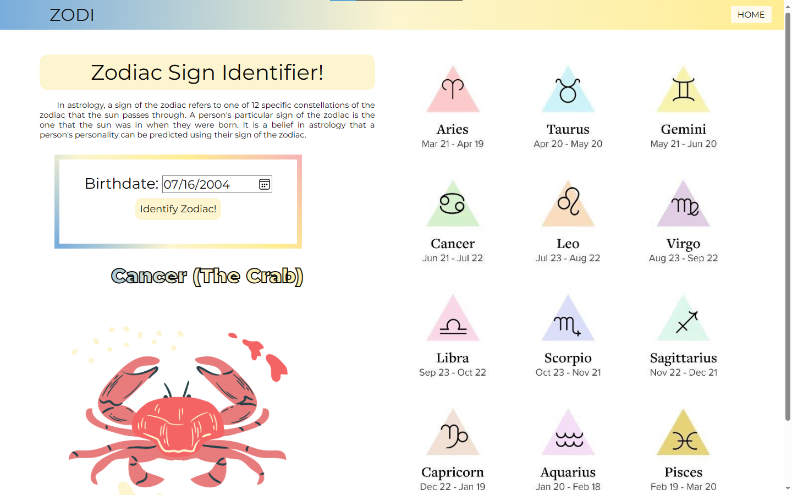

# ZodiacSignIdentifier

## A simple static website to identify your zodiac sign



## Info

- **Project Started:** Dec. 2023
- **Objective:** To create a user-friendly website that determines a person's zodiac sign based on their birth date.

## Features

- Calculates zodiac sign based on input day and month.
- Displays the corresponding zodiac sign image and name.
- Simple and intuitive user interface.

## Tech Stack

- HTML
- CSS
- JavaScript

## Files Directory Structure

```
.
├── index.html
├── README.md
├── style.css
├── ZODI.png
├── zodiacJS.js
└── images/
```

## To use the website

- Click the link: https://aron-arboleda.github.io/ZodiacSignIdentifier/

<br>&copy; 2025 Aron-Arboleda. All rights reserved.
